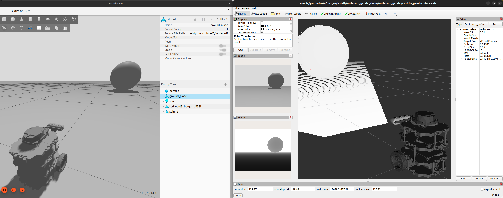

# Turtlebot3-based project descriptions

Turtlebot3 extended with a Intel D435i depth camera.
```bash
$> export PROJECT_MODEL=turtlebot3_burger_d435i
$> ros2 launch turtlebot3_gazebo projects_empty_world.launch.py
```

