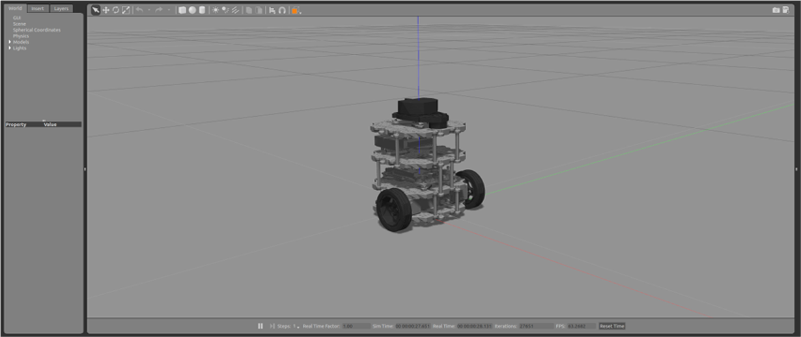
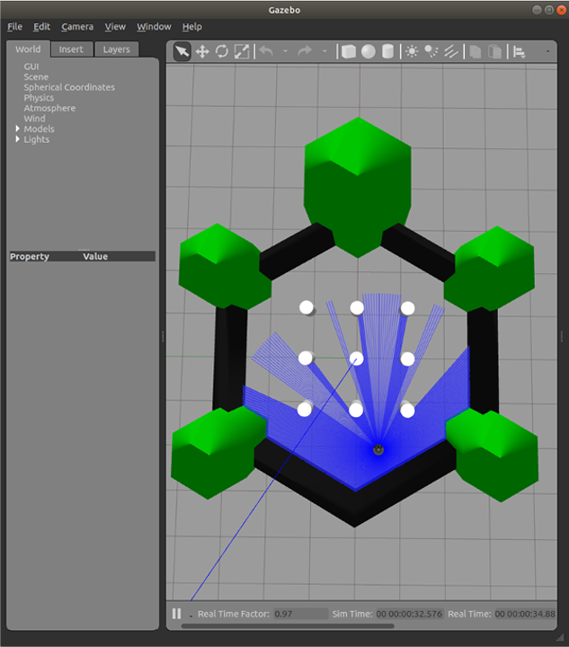

Fork from Robotis Turtlebot3 packages (https://github.com/ROBOTIS-GIT/turtlebot3_simulations).

```bash
$> cd ~/ros2_ws
$> colcon build --packages-select turtlebot3_gazebo
$> source install/setup.bash
$> ros2 launch turtlebot3_gazebo empty_world.launch.py
```


```bash
$> ros2 launch turtlebot3_gazebo turtlebot3_world.launch.py
```


